% Kubernetes on bare metal?   Sure, BUT…
% Peter B. (LogMeIn)
% November 16, 2017

# Expectations

from a provider/maintainer perspective:

~~~bash
- ~local Container-Orchestration Cluster
- on X bare metal nodes
- with an reliable recovery solution
- with an easy update process
- is scalable
- is extendible 
- automated
~~~

# Pre-\*Containerized\*-Age 

# Pre-\*Containerized\*-Age

# Pre-\*Containerized\*-Age

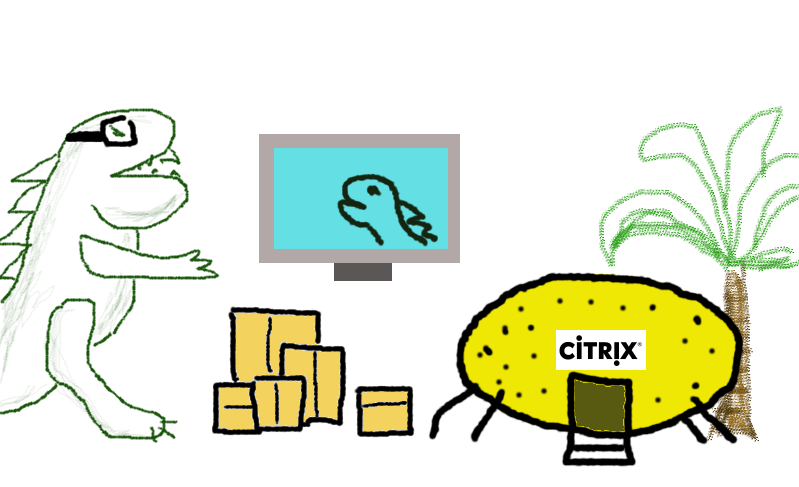

# The Servers

# The Metal

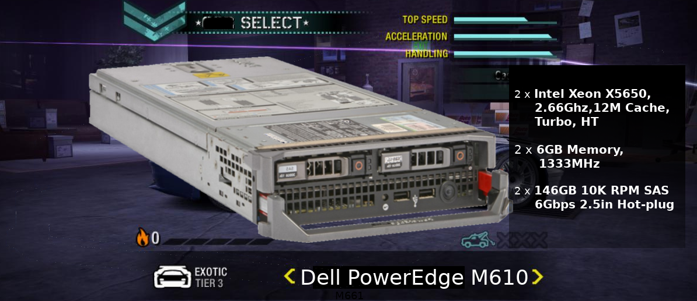

# XenServers

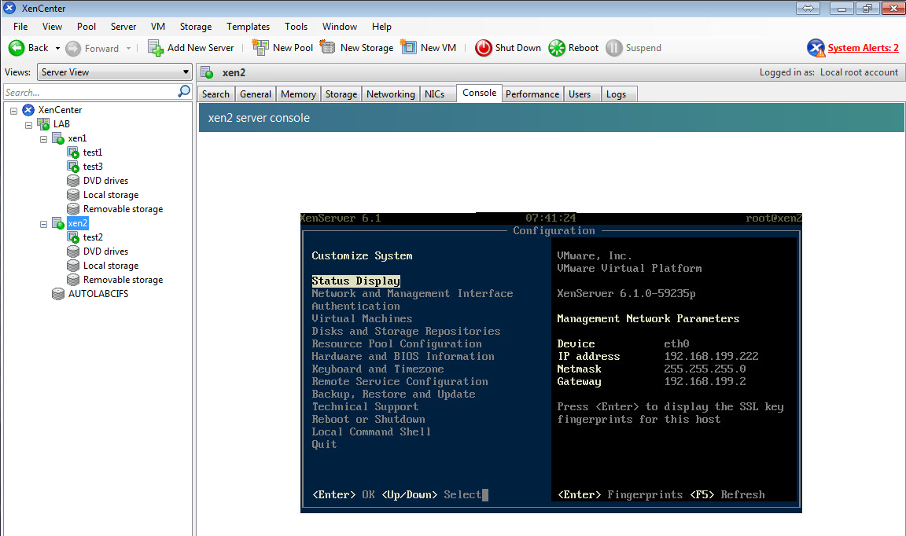

# XenServers

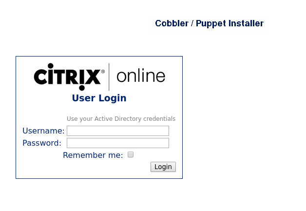

# XenServers

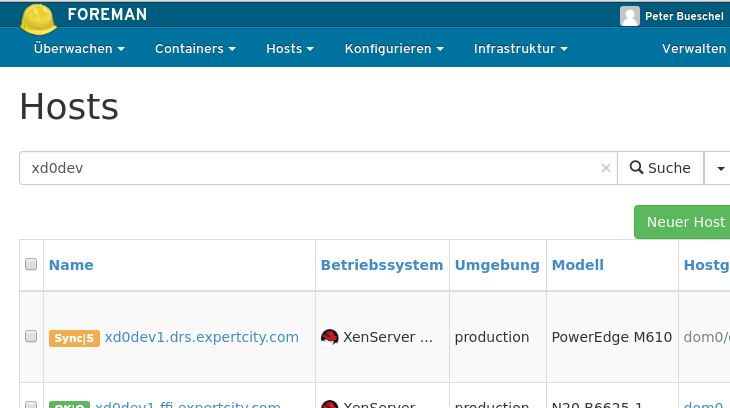

# XenServers

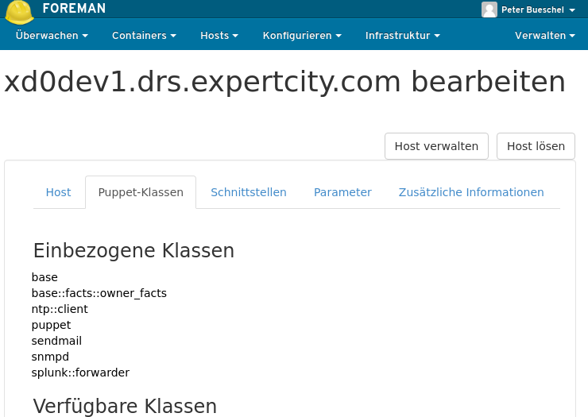

# Cloudstack

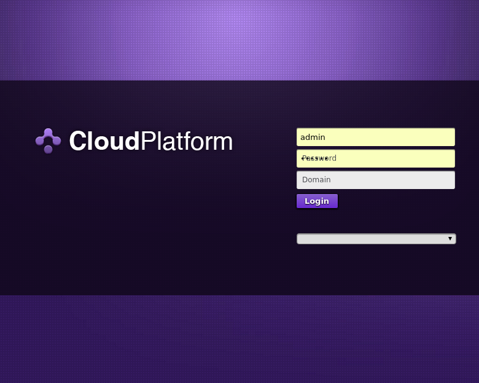

# Cloudstack

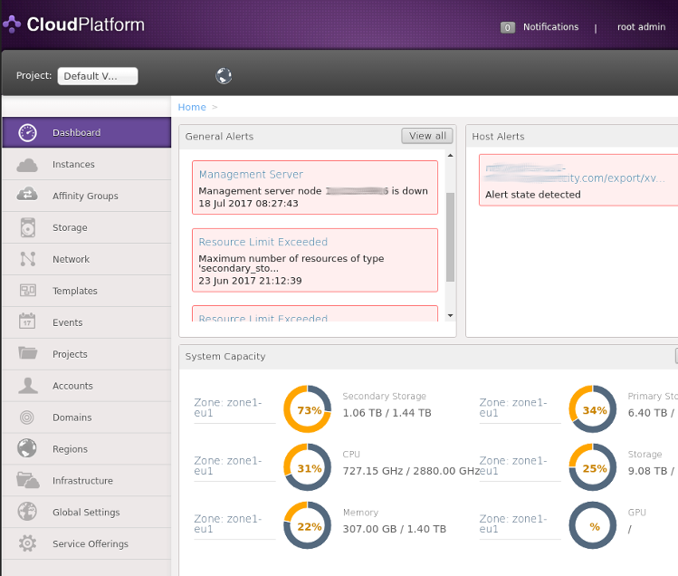

# Cloudstack

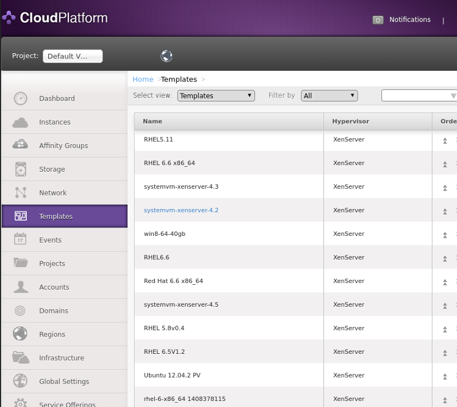

# BUT…

# BUT…

~~~text
              ________________________________________
             < You shall have no other Gods beside me >
              ----------------------------------------
                 \
                  \
                                 ##        .
                           ## ## ##       ==
                        ## ## ## ##      ===
                    /""""""""""""""""___/ ===
               ~~~ {~~ ~~~~ ~~~ ~~~~ ~~ ~ /  ===- ~~~
                    \______ o          __/
                     \    \        __/
                       \____\______/
~~~

# Expectations

from a provider/maintainer perspective:

~~~bash
- ~local Container-Orchestration Cluster
- on X bare metal nodes
- with an reliable recovery solution
- with an easy update process
- is scalable
- is extendible 
- automated
~~~

. . .

> But…

. . .

> "You must unlearn what you have learned."

# BUT-Journey

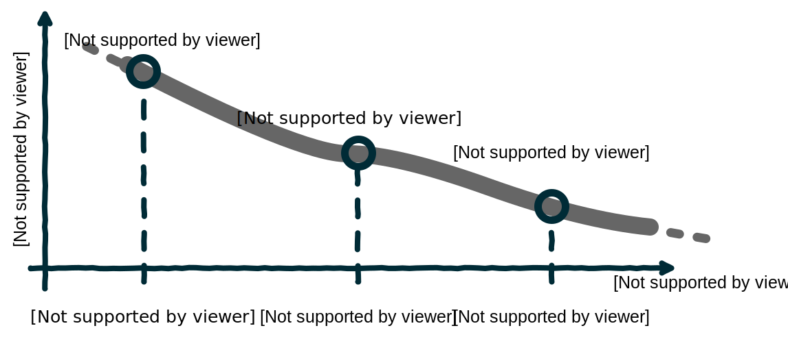

---

# From-Scratch

> “First learn stand, then learn fly. Nature rule, Daniel—san, not mine.”

---

## Expected Steps

. . .

1. RTFM 😐

. . .

2. OS installations 😕

. . .

3. Prepare nodes somehow (docker, network, ...) 😛

. . .

4. K8s installations 😐

. . .

5. Annoy teammates with the new cluster 😀

## RTFM

> [Picking the Right Solution](https://kubernetes.io/docs/setup/pick-right-solution/). But…

. . .

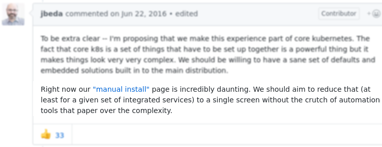

. . .

## RTFM

mix of

. . .

- ["Creating a Custom Cluster from Scratch"](https://kubernetes.io/docs/getting-started-guides/scratch/)

. . .

- ["getting-started-guides/docker-multinode"](https://web.archive.org/web/20160502165028/http://kubernetes.io:80/docs/getting-started-guides/docker-multinode),

. . .

- ["multinode docker master"](https://web.archive.org/web/20160510184355/http://kubernetes.io:80/docs/getting-started-guides/docker-multinode/master)

. . .

- ["locally via Docker"](https://web.archive.org/web/20160430123558/http://kubernetes.io:80/docs/getting-started-guides/docker/)

. . .

- "github issue pages": e.g. <https://github.com/moby/moby/pull/22806> or [https://github.com/kubernetes/issues/4869](https://github.com/kubernetes/kubernetes/issues/4869)

. . .

- …

## Quintessence

~~~Bash
on all hosts:
- install OS, But…
- install Docker and create a second docker daemon instance, But…
- delete the default Docker-created bridge and iptables rules
- export Etcd and Flannel related environment variables
- download and run Etcd, But…
- download and run Flannel, But…

on master node:
- docker run ..... hyperkube kubelet, But…

on worker node:
- docker run ..... hyperkube kubelet, But…
- docker run ..... hyperkube proxy
~~~

## First attempts of automations

. . .

example shell script:

~~~bash
export MASTER_IP=$(hostname -i|cut -d" " -f 1)
export K8S_VERSION=v1.3.0
export FLANNEL_VERSION=0.5.5
export FLANNEL_CONTAINER_NAME=flanneld
export FLANNEL_IPMASQ=false
export FLANNEL_IFACE=eth0
export ETCD_SERVERS=http://${IP_MASTER}:2379,http://${IP_NODE1}:22379,http://${IP_NODE2}:2379

# flannel env comes from subnet.env, created at first run of flanneld
#FLANNEL_NETWORK=192.168.0.0/16
#FLANNEL_SUBNET=192.168.24.1/24
#FLANNEL_MTU=1472
#FLANNEL_IPMASQ=false

# on alpine
sysctl -w kernel.grsecurity.chroot_deny_chmod=0
sysctl -w kernel.grsecurity.chroot_deny_mknod=0
# get etcd
curl -L https://github.com/coreos/etcd/releases/download/v3.0.3/etcd-v3.0.3-linux-amd64.tar.gz -o etcd-v3.0.3-linux-amd64.tar.gz
tar xzvf etcd-v3.0.3-linux-amd64.tar.gz && cd etcd-v3.0.3-linux-amd64

#┌─────────────────────────────────────┐
#│   NEW DOCKER DAEMON INSTANCE        │
#└─────────────────────────────────────┘
# to have flanneld inside a container and not on the host we need to start/'bootstrap'
# a seperate instance of the docker daemon, which allows run containers only with host net.
sh -c 'docker daemon -H unix:///var/run/docker-bootstrap.sock -p /var/run/docker-bootstrap.pid --iptables=false --ip-masq=false --bridge=none --graph=/var/lib/docker-bootstrap 2> /var/log/docker-bootstrap.log 1> /dev/null &'
# TODO add this to systemd, init.d, ...

#┌─────────────────────────────────────┐
#│   ETCD                              │
#└─────────────────────────────────────┘
# start the first nodes of our etcd cluster using this custom socket
./run_etcd_server1.sh
# ...'docker run' command inside:
# docker -H unix:///var/run/docker-bootstrap.sock run -d --net=host ....

# now add the flannel config to the key/value store etcd
./add_flannel_config.sh
#
#┌─────────────────────────────────────┐
#│   FLANNEL ON MASTER                 │
#└─────────────────────────────────────┘
# before docker stop, check if etcd member is running on this docker instance
# if so, then:
# - delete membership:
#   * get the membership id:
ETCDCTL_API=3 ./etcdctl --endpoints=http://${IP_MASTER}:2379 member list
#   * remove:
ETCDCTL_API=3 ./etcdctl --endpoints=http://${IP_MASTER}:2379 member remove 7a283d9ea
2d03a3d
# - add new member (before start the new container on the 'system-docker' instance
ETCDCTL_API=3 ./etcdctl --endpoints=http://${IP_NODE1}:2379 member add etcd_docker0
4_1 --peer-urls="http://${IP_NODE1}:2381"

# flannel reconfigures the bridge used by docker
# ─────> restart the 'normal' not the 'bootstrap' instance of docker instance, run flannel, restart docker
/etc/init.d/docker stop
# We use the 'udp' flannel backend, so
modprobe tun
# run flannel container on the 'bootstrap' instance.
# we need /dev/net/ for the 'tun' device 
docker -H unix:///var/run/docker-bootstrap.sock run -d \
       --net=host \
       --name ${FLANNEL_CONTAINER_NAME} \
       --privileged \
       -v /dev/net:/dev/net \
       quay.io/coreos/flannel:${FLANNEL_VERSION} \
       /opt/bin/flanneld \
       --etcd-endpoints=http://${ETCD_SERVERS} \
       --ip-masq=${FLANNEL_IPMASQ} \
       --iface=${FLANNEL_IFACE}

# we need the subnet.env settings from inside the flanneld container
docker -H unix:///var/run/docker-bootstrap.sock \
      exec ${FLANNEL_CONTAINER_NAME} cat /run/flannel/subnet.env > subnet.env
# add settings to the env
source subnet.env

#┌─────────────────────────────────────┐
#│   CONFIGURE OLD DOCKER DAEMON       │
#└─────────────────────────────────────┘
# set the flannel 'subnet' and 'mtu'
# in alpine it is directly inside the /etc/init.d/docker file:

# add to the command_args="... --bip=${FLANNEL_SUBNET} --mtu=${FLANNEL_MTU}"

# remove the existing bridge, so that a restart of docker will create a new one with the new given
# flags.
ifconfig docker0 down
brctl delbr docker0
# now start the old/normal/custom docker daemon
/etc/init.d/docker start
#
#┌─────────────────────────────────────┐
#│   RUN THE K8S MASTER                │
#└─────────────────────────────────────┘
mkdir -p /var/lib/kubelet
mount --bind /var/lib/kubelet /var/lib/kubelet
mount --make-shared /var/lib/kubelet

# check if you have the kubelet_manifest folder

docker run \
    --volume=/:/rootfs:ro \
    --volume=/sys:/sys:ro \
    --volume=/var/lib/docker/:/var/lib/docker:rw \
    --volume=/var/lib/kubelet/:/var/lib/kubelet:rw,shared \
    --volume=/var/run:/var/run:rw \
    --volume=/root/kubelet_manifest:/etc/kubernetes/manifests-multi:rw \
    --net=host \
    --privileged \
    --pid=host \
    -d \
    gcr.io/google_containers/hyperkube-amd64:${K8S_VERSION} \
    /hyperkube kubelet \
        --allow-privileged=true \
        --api-servers=http://${IP_MASTER}:8080 \
        --v=2 \
        --address=0.0.0.0 \
        --enable-server \
        --hostname-override=${IP_MASTER} \
        --cluster-dns=10.0.0.10 --cluster-domain=cluster.local \
        --config=/etc/kubernetes/manifests-multi \
        --healthz-port=0 \
        --read-only-port=0 \
        --cadvisor-port=0

#

#┌─────────────────────────────────────┐
#│   ADD A K8S NODE TO THE CLUSTER     │
#└─────────────────────────────────────┘
# the addr. of the api server is the one from the master
# config file is also not needed
docker run \
    --volume=/:/rootfs:ro \
    --volume=/sys:/sys:ro \
    --volume=/var/lib/docker/:/var/lib/docker:rw \
    --volume=/var/lib/kubelet/:/var/lib/kubelet:rw,shared \
    --volume=/var/run:/var/run:rw \
    --volume=/root/kubelet_manifest:/etc/kubernetes/manifests-multi:rw \
    --net=host \
    --privileged \
    --pid=host \
    -d \
    gcr.io/google_containers/hyperkube-amd64:${K8S_VERSION} \
    /hyperkube kubelet \
        --allow-privileged=true \
        --api-servers=http://${IP_MASTER}:8080 \
        --v=2 \
        --address=0.0.0.0 \
        --enable-server \
        --hostname-override=${IP_NODE1} \
        --cluster-dns=10.0.0.10 --cluster-domain=cluster.local \
        --healthz-port=0 \
        --read-only-port=0 \
        --cadvisor-port=0

# you need a second container with the k8s proxy
sudo docker run -d \
    --net=host \
    --privileged \
    gcr.io/google_containers/hyperkube-amd64:v${K8S_VERSION} \
    /hyperkube proxy \
        --master=http://${IP_MASTER}:8080 \
        --v=2

~~~

## Discussion

. . .

- significant learning curve
- really useful for debugging also in more automated deployments
- full control over installation
- needs automations

---

# Kargo / Kubernetes-Ansible

> running Ansible playbooks installing K8s clusters

. . .

> But… 

. . .

> it's now again Kubespray

# Kubespray

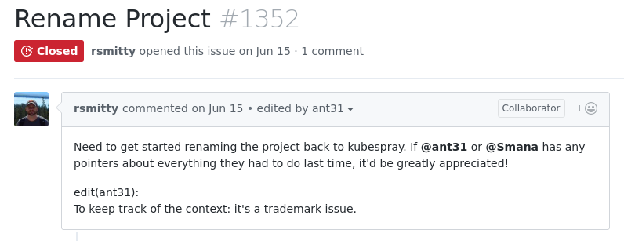

---

## Expected Steps

. . .

1. RTFM 😐

. . .

2. OS installations 😕

. . .

3. Prepare the nodes (sshd, ...) 😐

. . .

4. Install requirements on local host (Ansible, ...) 😐

. . .

5. Configure Ansible (inventory file, yml files, ...) 😕

. . .

6. Run Ansible 😐

. . .

7. Annoy teammates with the new cluster 😀

## RTFM

. . .

- [github](https://github.com/kubernetes-incubator/kubespray)

. . .

- [kubernetes/guide](https://kubernetes.io/docs/getting-started-guides/kubespray/)

## Quintessence

~~~Bash
on all hosts:
- install OS, But…
- install and configure e.g. sshd

on local host:
- install Ansible, Jinja, python-netaddr
- create an inventory file, But…
- customize the ansible-playbooks provided by kubespray, But…
- run playbooks
~~~

## Discussion

. . .

- needs a admin/local/bastion host
- needs Ansible skills
- hides the Etcd, Overlay Network and Kubernetes installation
- offers update-ability
- can be also used for the 'cloud'
- still some preparation of bare metal hosts
- still installation of bare metal hosts

---

# Digital-Rebar

. . .

# Digital-Rebar

> But…

. . .

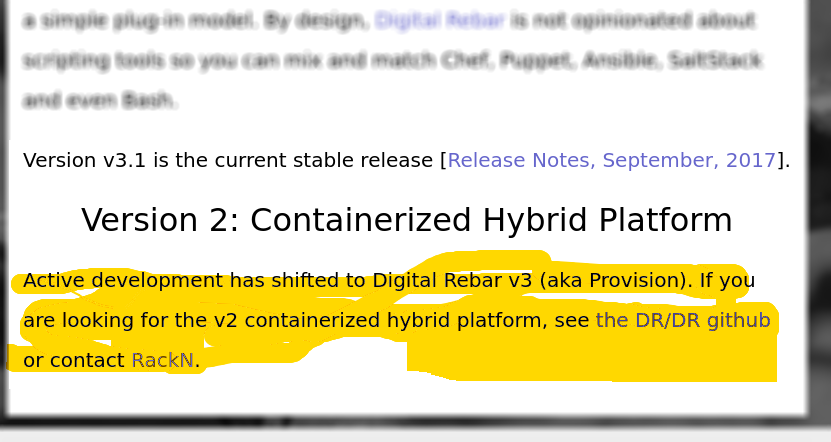

---

## Expected Steps

. . .

1. RTFM 😐

. . .

2. Install Digital-Rebar locally 😐

. . .

3. Configure Digital-Rebar 😐

. . .

4. Deploy a K8s cluster 😐

. . .

5. Annoy teammates with the new cluster 😀

## RTFM

. . .

- [rebar.digital](http://rebar.digital/)

. . .

> But… 

. . .

- better watch the right youtube [clips](https://www.youtube.com/watch?v=uYG9nstYpD4&list=PLXPBeIrpXjfgurJuwVjZkcfmatCoXYM_v)

## Quintessence

~~~Bash
on local host:
- install Digital-Rebar
- configuration and installation of K8s via WebUI
~~~

## Installation

> But…

. . .

fixings:

- 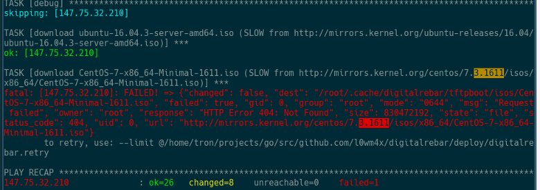

. . .

- ["deleted virbr0"](http://digital-rebar.readthedocs.io/en/latest/development/dev_env/kvm-slaves.html?highlight=libvirt)
- …

## Configure DR and Deploy a K8s cluster

. . .

- small demo with [packet.net](https://www.packet.net/)

. . .

> But…

. . .

> nothing 😀

. . .

see here <file:./pics/digitalRebarInstallation.mp4>

## Discussion

. . .

- needs a admin/local/bastion host
- based on Kargo, maybe later also on Kubespray
- automates all steps (installation, preparation, updating, ...)
- needs fixings to work

---

# Summary

. . .

- while the toolset around K8s deployments increases

. . .

- also the community enhance K8s itself (documentations, installations, ...)

. . .

- still cutting edge — breaking changes in toolsets and K8s

. . .

- (my opinion) hardest steps are: finding the right documentation, being up-to-date
